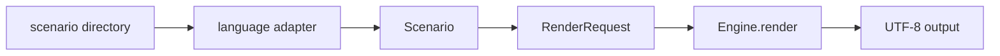
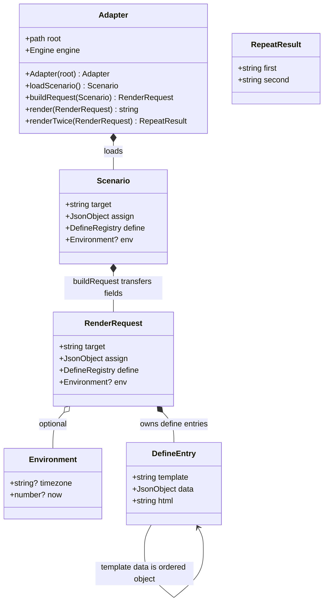
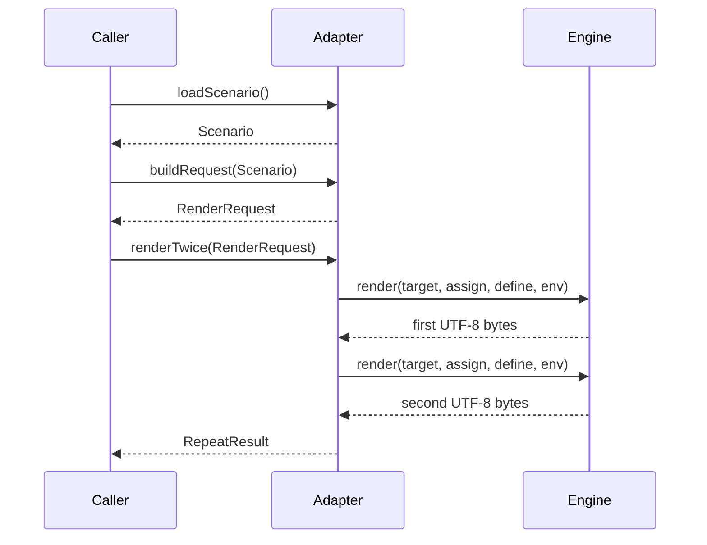
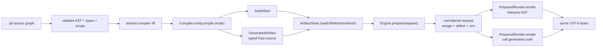
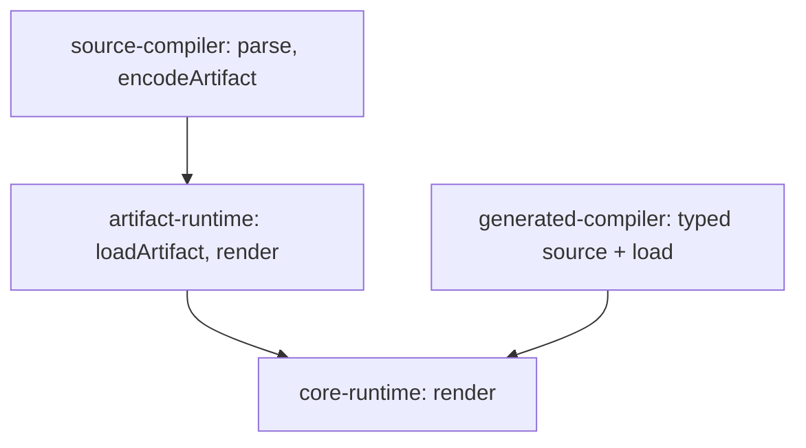

# 런타임

[English](runtime.md).

이 문서는 엔진 API, 템플릿 이름과 로딩, 스코프, 루프, include, 템플릿 define, block 태그, 출력, 제한, 오류 동작, 브라우저 렌더링, 산출물과 페이지 캐시를 정의한다. 값 규칙은 [데이터 모델](/ko/spec/data-model), 표현식 평가는 [표현식](/ko/spec/expressions), 함수는 [함수](/ko/spec/functions), AST는 [AST](/ko/spec/ast), 오류 코드는 [오류](/ko/spec/errors)에 정의되어 있다.

## API

- **RT-1** 모든 구현은 선언한 지원 레벨에 필요한 연산을 제공한다. 이름은 각 언어의 관례를 따르며 같은 레벨을 선언한 구현은 같은 논리 연산을 제공한다.

```
parse(source, name, { delimiters }) -> Template
Engine(options: { loader, functions, limits, delimiters })
engine.register(name, fn)
engine.render(target: name | Template, assign, { define, env }) -> string
engine.prepare(target: name | Template, assign, { define, env }) -> PreparedRender
prepared.render() -> string
Loader.load(name) -> { source | ast, version }
Compiler.compile(sourceGraph, mode: ast | gen) -> compiled artifact
ArtifactStore.loadOrRefresh(sourceGraph, refresh: dev | true | false) -> compiled artifact
Engine.prepare(compiled artifact, request) -> PreparedRender
PageCache.get(key) -> string | miss
PageCache.put(key, html, ttl: positive seconds | 0 | null)
PageCache.getOrSet(key, ttl, render)

```

`Engine`은 완성된 `Program` 하나를 받아 표현 방식을 검사하지 않고
`prepare`와 `render`를 위임합니다. `AstProgram`과 `GeneratedProgram`은
이 계약을 독립적으로 구현합니다. compiler와 artifact store가 engine을
만들기 전에 mode와 갱신 정책을 선택합니다.

- **RT-2** `parse`는 다른 템플릿을 로드하지 않고 AST 문서에 정의된 AST를 생성한다. include와 block 태그는 렌더 중에 해석한다.
- **RT-3** `render`는 템플릿 이름 또는 파싱된 템플릿을 받는다. 이름을 받으면 엔진이 로더로 템플릿을 로드한다. 전체 출력을 하나의 문자열로 반환한다.
- **RT-4** `assign`은 호스트 바인딩 규칙으로 변환한 map이다. `define`은 템플릿 define map(RT-24)이다. `env`는 함수 문서에 정의된 `timezone`과 `now`를 가진 map이다. `define`과 `env`는 각각 생략할 수 있다. 생략한 `define`은 빈 map이다.
- **RT-5** 엔진 옵션의 `functions`와 `register`는 함수 문서에 정의된 대로 호스트 함수를 추가한다.
- **RT-6** 엔진 옵션의 `limits`는 RT-33의 제한 값을 덮어쓴다. 생략한 제한은 기본값을 유지한다.
- **RT-61** `AstProgram`과 `GeneratedProgram` 모두 `prepare`에서 `assign`을 바인딩하고 `define`과 `env`를 해석하며 target을 선택한다. 반환된 program별 상태는 동일한 `PreparedRender.render` 연산을 제공한다.
- **RT-62** `PreparedRender.render`는 렌더마다 필요한 scope, output, 실행 상태만 만든다. 입력이 바뀌지 않은 반복 호출은 같은 UTF-8 바이트를 출력한다. `render`는 `prepare(...).render()`와 같으며 단일 호출 편의 연산으로 유지한다.
- **RT-63** 컴파일 모드는 `ast` 또는 `gen`이다. `ast`는 AST artifact를 만들고 AST renderer로 해석한다. `gen`은 호스트 언어 renderer 코드를 만들고 직접 호출한다. 생성 렌더러도 AST renderer와 동일한 정규화 요청(`target`, 바인딩된 `assign`, 바인딩된 `define`, 해석된 `env`)을 받는다. 모드가 산출물 갱신 정책을 결정하지는 않는다.
- **RT-64** 산출물 갱신 정책은 `dev`, `true`, `false`다. build coordinator는 `dev`에서 compiler 호출마다 생성하고, `true`에서 digest가 바뀐 뒤 생성하며, `false`에서 소스를 읽지 않는다. `false`에서 배포 산출물이 없거나 오래되거나 손상되면 오류다.
- **RT-65** 페이지 캐시는 컴파일 산출물과 별도로 최종 HTML을 저장한다. 양수 TTL은 해당 시간이 지나면 만료되고 `0`과 `null`은 무기한이다. 캐시 hit는 비즈니스 로직과 템플릿 렌더링을 건너뛴다. 키에는 출력에 영향을 주는 모든 값이 포함되어야 한다.
- **RT-66** `getOrSet`은 hit에서 `render`를 호출하지 않고 캐시 HTML을 반환한다. miss에서는 `render`를 한 번 호출하고 반환된 HTML을 TTL과 함께 저장한 뒤 반환한다.
- **RT-67** 준비된 렌더 계약은 단일 제품 manifest인 [`tools/compiler/interface.json`](../../tools/compiler/interface.json)에 선언한다. 인터페이스 검사는 필요한 언어 매핑, 지원 수준, 연산이 하나라도 없으면 실패한다.
- **RT-69** `Engine`은 `Program` 하나만 소유한다. generated 실행은 AST 자리표시자, parser, AST renderer를 만들거나 보유하지 않고, AST 실행은 생성 코드를 보유하지 않는다. mode 선택이 engine 안으로 돌아오면 네 runtime의 인터페이스 검사가 실패해야 한다.

program 도표는 단일 제품 manifest에서 생성한다.

```mermaid
<!--@include: ../../tools/compiler/generated/compiler-architecture.mmd-->
```

```mermaid
<!--@include: ../../tools/runtime/generated/prepared-execution-classes.mmd-->
```

compiler manifest는 공개 `Program`, `Engine`, `AstProgram`, generated program 선언 구조도 고정한다. interface gate는 TypeScript는 compiler API, Go는 `go/parser`, Rust는 `syn`, PHP는 Reflection으로 읽는다. 연산 누락·추가, 인자 수 변경, 소유자 변경, 구체 AST program 누락이 있으면 빌드가 실패한다.
- **RT-42** 엔진 옵션과 `parse`의 `delimiters`는 렉시컬 문서가 정의하는 대로 태그 구분자를 선택한다. 기본값은 `{}`다. 템플릿 파일의 구분자 지시문은 그 파일에 대해 옵션보다 우선한다.

## 언어 간 렌더 계약

실행 가능한 showcase의 어댑터 경계는 공통 [compiler interface manifest](../../tools/compiler/interface.json)에 포함한다. 이 manifest는 타입, 필드 순서, nullable 여부, 필수 필드, 소유 관계, 생성자, 연산, 오류, 전제조건, 상태 전이와 언어별 이름 매핑을 선언한다. 각 언어의 native 타입은 이 계약을 표현하며 계약을 다시 설계하지 않는다.





```mermaid
stateDiagram-v2
    [*] --> ready : constructor
    ready --> scenario-loaded : loadScenario
    scenario-loaded --> request-built : buildRequest
    request-built --> rendered : render
    request-built --> rendered : renderTwice
    failed --> request-built : recover after render error
    failed --> request-built : recover after renderTwice error
```



논리적 요청은 다음 JSON 형태다.

```json
{
  "target": "layout",
  "assign": { "title": "Mock title" },
  "define": {
    "layout": "layout.tpl",
    "contents": "content.tpl"
  },
  "env": { "timezone": "Z", "now": 1789084800 }
}
```

- **RT-43** 모든 구현은 같은 `RenderRequest` 필드를 각 언어의 native API에 매핑한다. native map, object, JSON value는 어댑터 표현일 뿐이며 필드 이름, 중첩, 값 타입을 바꾸지 않는다.
- **RT-44** JSON 값은 `null`, boolean, number, string, array 또는 문자열 키를 가진 object다. `assign`은 루트 object다. `define.data`가 있으면 역시 object다.
- **RT-45** 시나리오는 루트 기준 UTF-8 `*.tpl` 이름으로 템플릿 소스를 저장하고, `assign`은 `data.json`, define은 `define.json`, 선택적인 환경은 `env.json`에 저장한다. 시나리오 target은 `target`으로 따로 전달한다.
- **RT-46** 언어 간 픽스처 형식은 템플릿 define을 문자열 경로로 직접 표현한다. 추가 값이 필요한 define만 `template: string`과 선택적인 `data: object`를 가진 객체 또는 `html: string` 객체로 표현한다.
- **RT-47** 어댑터는 공통 JSON을 해석해 native API 값을 만들 수 있지만 컨트롤러 데이터 추가, 필드 이름 변경, 필터 적용, 그 밖의 요청 재구성을 해서는 안 된다.
- **RT-48** 성공한 일치성 검사는 완전한 UTF-8 출력 바이트를 비교한 뒤 같은 요청을 다시 렌더해 반복 바이트도 비교한다.
- **RT-49** manifest는 `Adapter`, `Scenario`, `RenderRequest`, `DefineEntry`, `Environment`, `RepeatResult`의 설계 원본이다. record 필드와 union variant는 선언한 순서를 유지하며 소유 관계와 `from` 연결은 `Scenario`에서 `RenderRequest`로 어떤 값이 전달되는지 설명한다.
- **RT-50** [계약 생성기](../../scripts/generate-showcase-contract.mjs)는 TypeScript, JavaScript, Go, Rust 선언부, PHP 선언부와 Mermaid 원본을 생성한다. 생성 파일이 manifest와 다르면 계약 게이트가 실패한다.
- **RT-51** 언어 문법은 각 언어의 관례를 따를 수 있다(`NewAdapter`, `Adapter::new`, `__construct`는 생성자 이름이다). manifest 매핑을 통해 concrete type, 생성자 인자, 메서드 순서, 인자 타입, 반환 타입과 요청 필드는 동일하게 유지한다.
- **RT-52** [계약 검사기](../../scripts/check-showcase-contract.mjs)는 소스 선언, TypeScript 컴파일, Go 인터페이스 대입과 포맷, Rust trait 컴파일, PHP 문법과 `ReflectionClass`, 생성된 런타임 assertion, 모든 showcase 시나리오에 대한 다섯 어댑터 실행을 검사한다.
- **RT-53** 상태 증명은 `constructor -> loadScenario -> buildRequest -> renderTwice`를 실행하고, 잘못된 target 오류를 관찰하고, 원래 요청을 다시 렌더한 뒤 첫 번째·두 번째·복구 UTF-8 해시를 비교한다. 오류와 복구 과정에서 요청은 바뀌지 않는다.

## 지원 레벨과 컴파일 artifact

- **RT-54** 인터페이스 manifest는 하나의 compiler와 동등한 두 mode를 선언한다. `ast`는 `AstArtifact`, `gen`은 host language source와 artifact manifest를 반환한다. 둘 다 같은 prepared render 계약을 가진 `Program`을 만든다.
- **RT-55** 구현은 manifest에 지원 레벨을 선언한다. 같은 레벨을 선언한 구현은 같은 논리 타입과 연산을 제공하고, 언어별 표기는 mapping에만 기록한다. 지원하지 않는 연산은 그 레벨에 넣지 않으며 빈 메소드나 runtime fallback으로 만들지 않는다.
- **RT-56** TypeScript, Go, Rust, PHP는 `core-runtime`, `artifact-runtime`과 두 `Program` variant를 제공한다. Build compiler는 `source-compiler`와 generated target backend 네 개를 제공한다. JavaScript ESM은 TypeScript backend가 생성하며 별도 의미 구현으로 세지 않는다.
- **RT-57** Artifact manifest는 contract format, mode, target language, entry, source digest, type digest, contract digest, output path를 포함한다. Artifact는 service 시작 전에 생성하고 process에 한 번 load하거나 정적으로 연결한다.
- **RT-58** Artifact 갱신은 build 정책이다. `dev`는 compiler를 호출할 때마다 재생성하고, `true`는 source, type, contract digest가 달라지면 재생성하며, `false`는 source를 읽지 않고 배포 artifact만 사용한다. Development watcher는 재생성 뒤 정적으로 연결한 Go와 Rust process를 rebuild하고 restart한다.
- **RT-59** Render request 경로에서는 parsing, source 탐색, artifact 생성, host compilation을 하지 않는다. 같은 program을 같은 assign, define, environment로 render하면 같은 output byte를 만들고 request를 변경하지 않는다.
- **RT-68** 타입 고정 generated artifact는 assign, 필드 전달 여부를 보존하는 definition data, definitions와 template input을 선언한다. 생성된 block은 root assign, 전달된 definition data 필드, block scope 순서로 입력을 적용한 뒤 대상 template 함수를 직접 호출한다. 미리 렌더한 문자열 slot은 generated template target이 아니다.

인터페이스는 두 실행 모드를 선언한다.

- **AST 모드**는 정규 AST artifact를 한 번 로드하고 요청마다 `assign`과 `define`을 바인딩해 AST를 해석한다. 완성된 cross-language mode다.
- **생성 모드**는 시작 전에 정규 AST의 각 node를 TypeScript, Go, Rust, PHP renderer로 lower하고 renderer를 한 번 load하거나 연결한 뒤 request마다 호출한다. 네 core runtime 모두 generated 적합성 case 211개를 통과한다. Request에서 template AST를 parse하거나 해석하지 않는다.


생성과 검증 명령은 다음과 같다.

```sh
node scripts/generate-showcase-contract.mjs --check
node scripts/check-showcase-contract.mjs
```

지원 레벨 도표도 언어별 선언부와 같은 manifest에서 생성한다.




## 이름과 로딩

- **RT-7** 템플릿 이름은 로더 루트 기준 상대 경로이며 구분자는 `/`이고 앞에 `/`가 없다. `render(name, ...)`으로 렌더하는 템플릿의 이름은 `name`이다. 문자열 target이 `define`의 템플릿 항목과 일치하면 그 항목의 경로를 렌더한다. 따라서 호스트는 `layout: "layouts/page.tpl"` 같은 define으로 레이아웃을 선택할 수 있다.
- **RT-8** include나 block 태그에 쓴 경로는 그 태그를 포함한 템플릿의 디렉터리를 기준으로 해석한다. 앞에 `/`가 있는 경로는 루트를 기준으로 해석한다. `.`과 `..` 세그먼트는 정규화한다. 정규화 후 루트를 벗어나는 경로는 `E_LOAD_OUTSIDE_ROOT`로 실패한다.
- **RT-9** 로더는 이름에 대해 소스 텍스트와 버전을 반환하거나 이름이 없음을 보고한다. 없는 이름은 `E_LOAD_NOT_FOUND`로 실패한다.
- **RT-10** 파일시스템 로더는 `root/name`을 읽고 파일의 수정 시각과 크기를 버전으로 사용한다. map 로더는 이름과 소스 또는 파싱된 AST를 메모리에 두고 콘텐츠 버전을 사용한다. 컴파일 artifact loader는 파싱된 AST를 보관하고 artifact 해시를 버전으로 사용한다.

## 스코프

- **RT-11** 렌더되는 각 템플릿 파일은 로컬 스코프 하나를 가진다. 파일 안의 블록(`{? }`, `{@ }`)은 스코프를 만들지 않는다.
- **RT-12** 변수는 로컬 스코프에서 먼저 찾고, 다음으로 컨텍스트 데이터에서 찾는다. 루트 템플릿의 컨텍스트 데이터는 `assign`이다. block의 컨텍스트 데이터는 RT-26에 정의한다. 어디에도 없는 이름은 `null`이다.
- **RT-13** 대입 `{x = e}`는 `x`를 로컬 스코프에 쓴다. 로컬 변수는 같은 이름의 컨텍스트 데이터 항목을 가린다. 대입은 컨텍스트 데이터를 변경하지 않는다.
- **RT-14** 루프 메타(`x.index_` 등)는 이름 `x`에 대해 활성인 루프에서 해석한다. 활성 루프 변수가 아닌 이름의 루프 메타는 `E_RUNTIME_UNKNOWN_LOOP`으로 실패한다.

## 루프

- **RT-15** `{@ v = e}`는 `e`를 한 번 평가한다. list는 원소를 순서대로 키 `0`, `1`, `2`, ...와 함께 반복한다. map은 값을 삽입 순서대로 그 키와 함께 반복한다. `null`은 0회 반복한다. bool, number, string은 `E_RUNTIME_TYPE`으로 실패한다.
- **RT-16** 각 반복은 로컬 스코프에서 `v`를 원소에 바인딩하고 `v`의 루프 메타를 설정한다: `index_`(0 기반 위치), `key_`(list 인덱스는 number, map 키는 string), `value_`(원소), `first_`(첫 반복에서 `true`), `last_`(마지막 반복에서 `true`), `size_`(원소 수).
- **RT-17** 루프가 끝나면 `v`와 그 루프 메타는 루프 전의 값으로 복원한다. 루프 전에 바인딩되지 않았던 이름은 루프 후에도 바인딩되지 않는다.
- **RT-18** 중첩 루프는 바깥 루프의 변수 이름을 다시 사용할 수 있다. 안쪽 바인딩과 메타는 안쪽 루프가 끝날 때까지 적용된다.
- **RT-19** 루프의 `{:}` 분기는 루프가 0회 반복했을 때 실행한다.
- **RT-20** 각 반복은 렌더의 반복 카운터를 증가시킨다. 반복 제한을 넘으면 `E_RUNTIME_LIMIT`으로 실패한다.

## include

- **RT-21** `{+ path}`는 해석된 경로의 템플릿을 로드하고 그 본문을 포함하는 템플릿의 로컬 스코프와 같은 컨텍스트 데이터에서 렌더한다. 포함된 템플릿의 대입은 태그 뒤에서 포함하는 템플릿에 보인다.
- **RT-22** 현재 include와 block 체인에서 이미 렌더 중인 템플릿은 `E_LOAD_CYCLE`로 실패한다.
- **RT-23** 각 include와 각 block은 중첩 깊이를 1 증가시킨다. 깊이 제한을 넘는 깊이는 `E_RUNTIME_DEPTH`로 실패한다.

## block

- **RT-24** `define` map은 식별자를 템플릿 define에 대응시킨다. define은 문자열 경로 또는 `template: path`와 선택적인 `data: map`을 가진 객체다. `html: string`을 가진 객체는 완성된 HTML을 제공한다. `render`에 주는 define의 템플릿 경로는 로더 루트 기준이다. 언어 간 픽스처 형식은 RT-46에 정의한다.
- **RT-25** `{# id}`는 `id`로 등록된 define을 렌더한다. 등록되지 않은 식별자는 `E_RUNTIME_BLOCK_UNDEFINED`로 실패한다.
- **RT-26** 템플릿 define은 새 로컬 스코프에서, 루트 `assign`, define의 `data`, 태그의 scope 인자 순으로 만든 컨텍스트 데이터로 렌더한다. 같은 이름은 뒤의 출처가 앞의 출처를 덮어쓴다. 호출하는 템플릿의 로컬 변수와 루프 메타는 보이지 않는다.
- **RT-27** HTML 항목은 그 문자열을 이스케이프 없이 출력에 쓴다. HTML 항목에 준 scope 인자는 무시한다.
- **RT-28** `{# id path ...}`는 `id`를 해석된 경로의 템플릿 항목으로 등록한 뒤 렌더한다. `id`가 이미 같은 경로로 등록되어 있으면 등록은 아무 일도 하지 않는다. `id`가 다른 경로나 HTML 항목으로 등록되어 있으면 태그는 `E_RUNTIME_BLOCK_REDEFINED`로 실패한다.
- **RT-29** 식별자 없는 `{# path ...}`는 해석된 경로의 템플릿을 등록 없이 템플릿 항목으로 렌더한다.
- **RT-30** scope 인자 `name:expr`은 `expr`을 호출 스코프에서 평가하고 block의 컨텍스트 데이터에 `name`을 바인딩한다. scope 인자 `name`은 `name:name`과 같다.
- **RT-31** `{?# id}`는 `id`가 등록되어 있으면 본문을, 아니면 `{:}` 분기를 렌더한다. 같은 렌더에서 앞선 `{# id path}` 태그가 한 등록은 보인다.

## 출력

- **RT-32** echo 태그는 safe 문자열을 그대로 쓴다. 그 외 값은 데이터 모델 규칙으로 문자열화한 뒤 `&` `<` `>` `"` `'`를 `&amp;` `&lt;` `&gt;` `&quot;` `&#39;`로 치환해 HTML 이스케이프한다. list나 map은 `E_RUNTIME_STRINGIFY`로 실패한다.

## 제한

- **RT-33** 기본 제한:

| 제한 | 기본값 | 오류 |
| --- | --- | --- |
| 렌더당 루프 반복 | 1,000,000 | `E_RUNTIME_LIMIT` |
| include와 block 중첩 깊이 | 32 | `E_RUNTIME_DEPTH` |
| 출력 크기 | 16 MiB | `E_RUNTIME_LIMIT` |
| 표현식 중첩 깊이 | 64 | `E_RUNTIME_LIMIT` |

- **RT-34** 표현식 중첩 깊이는 파서와 평가기가 검사한다.
- **RT-35** 출력 크기는 출력을 쓰면서 검사한다. 넘으면 렌더가 실패한다.

## 오류

- **RT-36** 렌더 중 오류는 렌더를 중단한다. `render`는 부분 출력을 반환하지 않고 오류 문서에 정의된 오류 객체를 보고한다.
- **RT-37** 두 실행 모드에서 모든 오류 코드는 같은 동작을 가진다. 선택한 모드는 미리 준비된 렌더러 표현만 바꾸며 오류 코드, 요청 구조와 출력 계약은 바꾸지 않는다.

## 브라우저

- **RT-38** TypeScript 패키지는 템플릿 소스나 파싱된 AST를 담은 map 로더로 브라우저에서 렌더한다.
- **RT-39** 브라우저에서 다시 렌더할 페이지를 렌더하는 서버는 assign 데이터를 `{= json(assign) | raw}`로 만든 내용의 `<script type="application/json">`으로 임베드한다. 브라우저는 데이터 모델 문서가 정의하는 대로 패키지의 파서로 그 JSON을 파싱하고, 같은 템플릿 이름을 같은 assign 데이터, define, env로 렌더해 같은 출력을 만든다.

## 캐싱

- **RT-40** 엔진은 템플릿을 `name@version`마다 한 번 파싱하고 로더가 같은 버전을 보고하는 동안 파싱된 템플릿을 재사용한다.
- **RT-41** 파싱된 템플릿은 AST JSON으로 저장하고 다시 로드할 수 있다. AST 렌더는 소스 렌더와 같은 출력을 만든다.
- **RT-60** Build compiler는 `--refresh dev|true|false`를 받는다. `dev`는 항상 쓰고, `true`는 source, type, contract digest가 일치하는 artifact를 재사용하며, `false`는 source를 읽거나 parse하지 않고 artifact도 쓰지 않는다.
