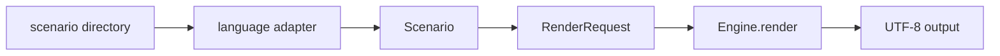
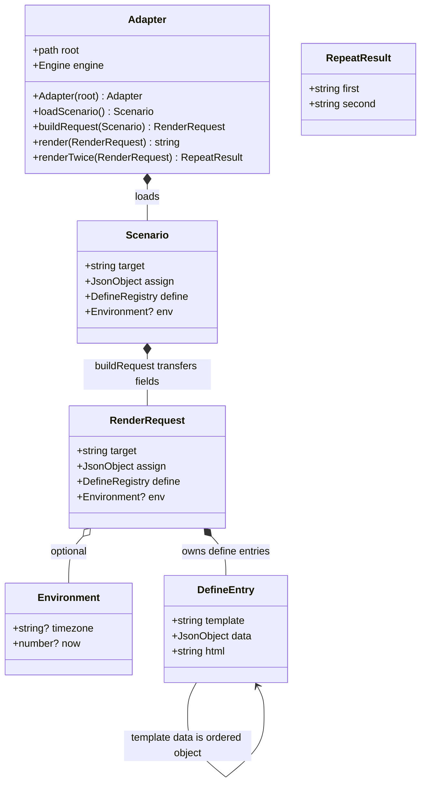
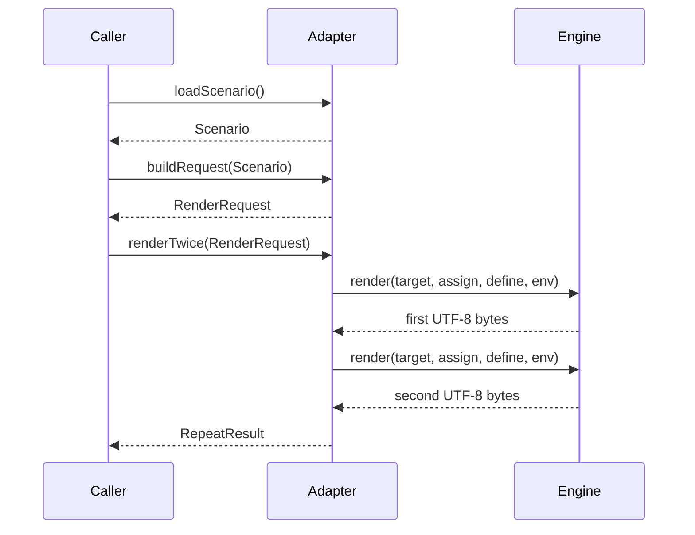
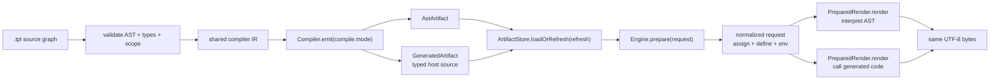
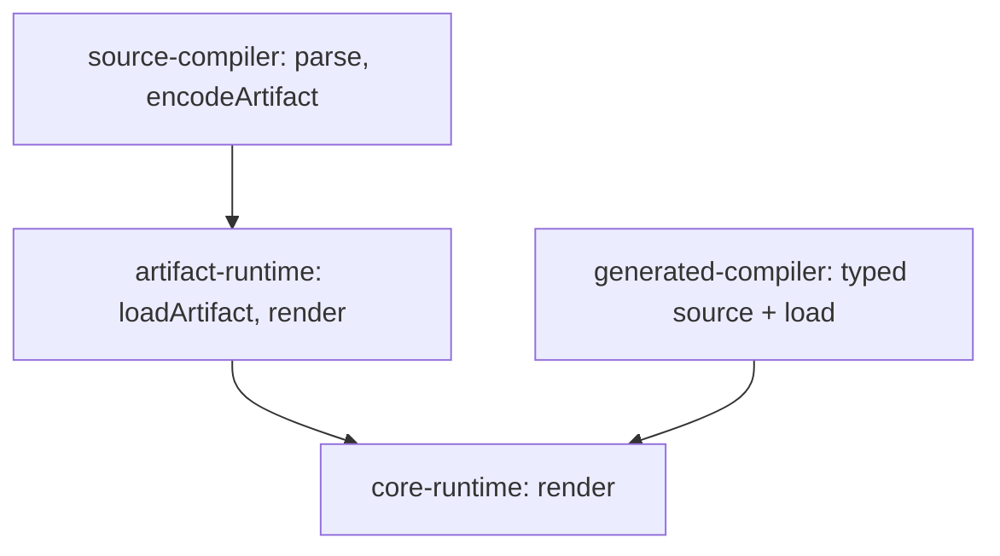

# Runtime

[한국어](runtime.ko.md).

This document defines the engine API, template names and loading, scope, loops, includes, template definitions, block tags, output, limits, error behavior, browser rendering and artifact/page caching. Value rules are defined in [data-model.md](data-model.md), expression evaluation in [expressions.md](expressions.md), functions in [functions.md](functions.md), the AST in [ast.md](ast.md) and error codes in [errors.md](errors.md).

## API

- **RT-1** Every implementation exposes the operations required by its declared support levels. Names follow the conventions of each language; implementations declaring the same level expose the same logical operations.

```
parse(source, name, { delimiters }) -> Template
Engine(options: { loader, functions, limits, delimiters })
engine.register(name, fn)
engine.render(target: name | Template, assign, { define, env }) -> string
engine.prepare(target: name | Template, assign, { define, env }) -> PreparedRender
prepared.render() -> string
Loader.load(name) -> { source | ast, version }
Compiler.compile(sourceGraph, mode: ast | gen) -> compiled artifact
ArtifactStore.loadOrRefresh(sourceGraph, refresh: dev | true | false) -> compiled artifact
Engine.prepare(compiled artifact, request) -> PreparedRender
PageCache.get(key) -> string | miss
PageCache.put(key, html, ttl: positive seconds | 0 | null)
PageCache.getOrSet(key, ttl, render)

```

`Engine` receives one complete `Program` and delegates `prepare` and
`render` without inspecting its representation. `AstProgram` and
`GeneratedProgram` implement that contract independently. The compiler and
artifact store select the mode and refresh policy before constructing the
engine.

- **RT-2** `parse` produces the AST defined in the AST document without loading other templates. Includes and block tags are resolved during rendering.
- **RT-3** `render` accepts a template name or a parsed template. With a name, the engine loads the template through its loader. It returns the complete output as one string.
- **RT-4** `assign` is a map converted by the host binding rules. `define` is the template definition map (RT-24). `env` is a map with `timezone` and `now` as defined in the functions document. Each of `define` and `env` may be omitted; an omitted `define` is an empty map.
- **RT-5** `functions` in the engine options and `register` add host functions as defined in the functions document.
- **RT-6** `limits` in the engine options overrides the limit values of RT-33. An omitted limit keeps its default.
- **RT-61** Both `AstProgram` and `GeneratedProgram` bind `assign`, resolve `define` and `env`, and select the target in `prepare`. The returned program-specific state exposes the same `PreparedRender.render` operation.
- **RT-62** `PreparedRender.render` creates only per-render scope, output and execution state. Repeated calls with unchanged input produce identical UTF-8 bytes. `render` is equivalent to `prepare(...).render()` and remains the single-call convenience operation.
- **RT-63** Compilation mode is `ast` or `gen`. `ast` produces an AST artifact interpreted by the AST renderer. `gen` produces host-language renderer code called directly. The generated renderer receives the same normalized request (`target`, bound `assign`, bound `define`, and resolved `env`) as the AST renderer. The mode does not select the artifact refresh policy.
- **RT-64** Artifact refresh is `dev`, `true` or `false`. Build coordination regenerates on every compiler invocation in `dev`, after a digest change in `true`, and never reads source under `false`. Missing, stale or corrupt deployed artifacts under `false` are errors.
- **RT-65** A page cache stores final HTML separately from compiled artifacts. A positive TTL expires after that many seconds; `0` and `null` mean forever. A cache hit bypasses business logic and template rendering. Its key must include every value that can change the output.
- **RT-66** `getOrSet` returns the cached HTML on a hit without calling `render`; on a miss it calls `render` once, stores the returned HTML with the TTL, and returns it.
- **RT-67** The prepared render contract is declared in the single product manifest, [`tools/compiler/interface.json`](../../tools/compiler/interface.json). Interface checks fail when any required language mapping, support level or operation is missing.
- **RT-69** `Engine` owns exactly one `Program`. Generated execution never creates or retains an AST placeholder, parser or AST renderer, and AST execution never retains generated code. The four runtimes must fail the interface gate if mode selection returns to the engine.

The program diagrams are generated from the single product manifest:

```mermaid
<!--@include: ../../tools/compiler/generated/compiler-architecture.mmd-->
```

```mermaid
<!--@include: ../../tools/runtime/generated/prepared-execution-classes.mmd-->
```
- **RT-42** `delimiters` in the engine options and in `parse` selects the tag delimiters as defined in the lexical document. The default is `{}`. A delimiter directive in a template file overrides the option for that file.

## Cross-language render contract

The executable showcase has one source of truth for its adapter boundary: the [interface manifest](../../tools/showcase/adapters/interface.json). It declares the types, field order, nullability, required fields, ownership, constructor, operations, errors, preconditions, state transitions and language name mappings. Native types express that contract in each language; they do not redefine it.





```mermaid
stateDiagram-v2
    [*] --> ready : constructor
    ready --> scenario-loaded : loadScenario
    scenario-loaded --> request-built : buildRequest
    request-built --> rendered : render
    request-built --> rendered : renderTwice
    failed --> request-built : recover after render error
    failed --> request-built : recover after renderTwice error
```



The logical request has this JSON shape:

```json
{
  "target": "layout",
  "assign": { "title": "Mock title" },
  "define": {
    "layout": "layout.tpl",
    "contents": "content.tpl"
  },
  "env": { "timezone": "Z", "now": 1789084800 }
}
```

- **RT-43** Every implementation maps the same `RenderRequest` fields to its native API. A native map, object or JSON value is an adapter representation; it does not change the field names, nesting or value types.
- **RT-44** A JSON value is `null`, boolean, number, string, array or object with string keys. `assign` is a root object. `define.data` is also an object when present.
- **RT-45** A scenario stores template sources as root-relative UTF-8 `*.tpl` names, `assign` in `data.json`, definitions in `define.json`, and the optional environment in `env.json`. The scenario target is passed separately as `target`.
- **RT-46** The cross-language fixture form represents a template definition directly as a string path. An object with `template: string` and optional `data: object`, or an object with `html: string`, is reserved for definitions that need those extra values.
- **RT-47** An adapter may decode the shared JSON and construct the native API values, but it must not add controller data, rename fields, apply filters or otherwise reshape the request.
- **RT-48** A successful parity check compares the complete UTF-8 output bytes and then renders the same request again to compare the repeated bytes.
- **RT-49** The manifest is the design source for `Adapter`, `Scenario`, `RenderRequest`, `DefineEntry`, `Environment` and `RepeatResult`. Its record fields and union variants keep their declared order; ownership and `from` links describe which values are transferred from `Scenario` into `RenderRequest`.
- **RT-50** [The contract generator](../../scripts/generate-showcase-contract.mjs) produces the TypeScript, JavaScript, Go and Rust declarations, the PHP declarations and the Mermaid sources. A generated file that differs from the manifest fails the contract gate.
- **RT-51** Language syntax may follow local conventions (`NewAdapter`, `Adapter::new` and `__construct` are constructor names), while the concrete type, constructor parameter, method order, argument types, return types and request fields remain the same through the manifest mappings.
- **RT-52** [The contract checker](../../scripts/check-showcase-contract.mjs) checks source declarations, TypeScript compilation, Go interface assignment and formatting, Rust trait compilation, PHP syntax and `ReflectionClass`, generated runtime assertions, and all five adapters on every showcase scenario.
- **RT-53** The state proof performs `constructor -> loadScenario -> buildRequest -> renderTwice`, observes an invalid-target error, renders the original request again, and compares first, second and recovered UTF-8 hashes. The request remains unchanged across the failure and recovery path.

## Support levels and compiled artifacts

- **RT-54** The interface manifest declares one compiler with two peer modes. `ast` returns an `AstArtifact`; `gen` returns host-language source and an artifact manifest. Both produce a `Program` with the same prepared render contract.
- **RT-55** An implementation declares its supported levels in the manifest. Implementations declaring the same level expose the same logical types and operations, with language-specific spelling recorded only in the mapping. An unsupported operation is absent from that level; it is not an empty method or a runtime fallback.
- **RT-56** TypeScript, Go, Rust and PHP provide `core-runtime`, `artifact-runtime` and both `Program` variants. The build compiler provides `source-compiler` and the four generated target backends. JavaScript ESM is emitted by the TypeScript backend and is not counted as another semantic implementation.
- **RT-57** An artifact manifest contains its contract format, mode, target language, entry, source digest, type digest, contract digest and output paths. The artifact is generated before service startup and is loaded or statically linked once into the process.
- **RT-58** Artifact refresh is a build policy. `dev` regenerates on every compiler invocation, `true` regenerates when a source, type or contract digest changes, and `false` reads no source and uses only the deployed artifact. A development watcher rebuilds and restarts statically linked Go and Rust processes after regeneration.
- **RT-59** Parsing, source discovery, artifact generation and host compilation never occur in the render request path. Rendering the same program with the same assign, define and environment produces identical output bytes and leaves the request unchanged.
- **RT-68** A typed generated artifact declares its assign, presence-preserving definition data, definitions and template inputs. A generated block calls its target template function directly after applying root assign, supplied definition data fields and block scope in that order. A pre-rendered string slot is not a generated template target.

The interface declares two execution modes:

- **AST mode** loads the canonical AST artifact once, binds `assign` and `define` for each request, and interprets the AST. This is the complete cross-language mode.
- **Generated mode** lowers each canonical AST node into a TypeScript, Go, Rust or PHP renderer before startup, loads or links that renderer once, and calls it for each request. This mode is partial until all 211 conformance cases pass in every target runtime. It does not parse or interpret template AST during a request.



The generation and verification commands are:

```sh
node scripts/generate-showcase-contract.mjs --check
node scripts/check-showcase-contract.mjs
```

The support-level graph is generated from the same manifest as the language declarations:



## Names and loading

- **RT-7** A template name is a path relative to the loader root, with `/` as separator, without a leading `/`. The name of a template rendered by `render(name, ...)` is `name`. When a string target matches a template entry in `define`, the entry path is rendered; this lets the host select a layout with a definition such as `layout: "layouts/page.tpl"`.
- **RT-8** A path written in an include or block tag is resolved against the directory of the template that contains the tag. A path with a leading `/` is resolved against the root. `.` and `..` segments are normalized. A path that leaves the root after normalization fails with `E_LOAD_OUTSIDE_ROOT`.
- **RT-9** A loader returns the source text and a version for a name, or reports that the name does not exist. A name that does not exist fails with `E_LOAD_NOT_FOUND`.
- **RT-10** A filesystem loader reads `root/name` and uses the modification time and size of the file as the version. A map loader holds names and sources or parsed ASTs in memory and uses a content version. A compiled artifact loader holds parsed ASTs and uses the artifact hash as the version.

## Scope

- **RT-11** Each rendered template file has one local scope. Blocks inside a file (`{? }`, `{@ }`) do not create scopes.
- **RT-12** A variable is looked up in the local scope first, then in the context data. The context data of the root template is `assign`. The context data of a block is defined in RT-26. A name found in neither is `null`.
- **RT-13** An assignment `{x = e}` writes `x` to the local scope. A local variable shadows a context data entry with the same name. Assignment never modifies context data.
- **RT-14** Loop metas (`x.index_` and the others) are resolved from the loops that are active for the name `x`. A loop meta for a name that is not an active loop variable fails with `E_RUNTIME_UNKNOWN_LOOP`.

## Loop

- **RT-15** `{@ v = e}` evaluates `e` once. A list iterates its elements in order with keys `0`, `1`, `2`, and so on. A map iterates its values in insertion order with its keys. `null` produces zero iterations. A bool, number or string fails with `E_RUNTIME_TYPE`.
- **RT-16** Each iteration binds `v` in the local scope to the element and sets the loop meta of `v`: `index_` (0-based position), `key_` (list index as number or map key as string), `value_` (the element), `first_` (`true` on the first iteration), `last_` (`true` on the last iteration), `size_` (the element count).
- **RT-17** After the loop ends, `v` and its loop meta are restored to the values they had before the loop. A name that was unbound before the loop is unbound after it.
- **RT-18** A nested loop may reuse the variable name of an outer loop. The inner binding and meta apply until the inner loop ends.
- **RT-19** The `{:}` branch of a loop runs when the loop produced zero iterations.
- **RT-20** Each iteration increments the iteration counter of the render. Exceeding the iteration limit fails with `E_RUNTIME_LIMIT`.

## Include

- **RT-21** `{+ path}` loads the template at the resolved path and renders its body in the local scope of the including template and in the same context data. Assignments in the included template are visible to the including template after the tag.
- **RT-22** A template that is already being rendered in the current chain of includes and blocks fails with `E_LOAD_CYCLE`.
- **RT-23** Each include and each block increases the nesting depth by one. A depth that exceeds the depth limit fails with `E_RUNTIME_DEPTH`.

## Block

- **RT-24** The `define` map maps an identifier to a template definition. A definition may be a string path, or an object with `template: path` and optional `data: map`; an object with `html: string` supplies finished HTML. Template paths in definitions given to `render` are relative to the loader root. The cross-language fixture form is defined in RT-46.
- **RT-25** `{# id}` renders the definition registered under `id`. An identifier that is not registered fails with `E_RUNTIME_BLOCK_UNDEFINED`.
- **RT-26** A template definition is rendered in a new local scope with context data built from, in order, the root `assign`, the definition `data`, and the scope arguments of the tag. A later source overrides an earlier one for the same name. Local variables and loop metas of the calling template are not visible.
- **RT-27** An HTML entry writes its string to the output without escaping. Scope arguments given with an HTML entry are ignored.
- **RT-28** `{# id path ...}` registers `id` as a template entry with the resolved path and then renders it. When `id` is already registered with the same path, the registration is a no-op. When `id` is registered with a different path or as an HTML entry, the tag fails with `E_RUNTIME_BLOCK_REDEFINED`.
- **RT-29** `{# path ...}` without an identifier renders the template at the resolved path as a template entry without registering it.
- **RT-30** A scope argument `name:expr` evaluates `expr` in the calling scope and binds `name` in the context data of the block. A scope argument `name` is equivalent to `name:name`.
- **RT-31** `{?# id}` renders its body when `id` is registered, and its `{:}` branch otherwise. Registrations made by earlier `{# id path}` tags in the same render are visible.

## Output

- **RT-32** The echo tag writes a safe string as is. Any other value is stringified by the data model rule and then HTML-escaped by replacing `&` `<` `>` `"` `'` with `&amp;` `&lt;` `&gt;` `&quot;` `&#39;`. A list or a map fails with `E_RUNTIME_STRINGIFY`.

## Limits

- **RT-33** Default limits:

| Limit | Default | Error |
| --- | --- | --- |
| Loop iterations per render | 1,000,000 | `E_RUNTIME_LIMIT` |
| Include and block nesting depth | 32 | `E_RUNTIME_DEPTH` |
| Output size | 16 MiB | `E_RUNTIME_LIMIT` |
| Expression nesting depth | 64 | `E_RUNTIME_LIMIT` |

- **RT-34** The expression nesting depth is checked by the parser and by the evaluator.
- **RT-35** The output size is checked as the output is written. Exceeding it fails the render.

## Errors

- **RT-36** An error during rendering aborts the render. `render` returns no partial output; it reports the error object defined in the errors document.
- **RT-37** Every error code has one behavior in both execution modes. The selected mode changes the prebuilt renderer representation, not the error code, request shape or output contract.

## Browser

- **RT-38** The TypeScript package renders in a browser with a map loader that holds the template sources or their parsed ASTs.
- **RT-39** A server that renders a page for later rendering in the browser embeds the assign data as `<script type="application/json">` whose content is produced by `{= json(assign) | raw}`. The browser parses that JSON with the parser of the package, as defined in the data model document, and renders the same template name with the same assign data, define map and env to produce the same output.

## Caching

- **RT-40** An engine parses a template once per `name@version` and reuses the parsed template while the loader reports the same version.
- **RT-41** A parsed template may be stored and reloaded as its AST JSON. Rendering an AST produces the same output as rendering its source.
- **RT-60** The build compiler accepts `--refresh dev|true|false`. `dev` always writes, `true` reuses artifacts whose source, type and contract digests match, and `false` never reads or parses source and never writes an artifact.
